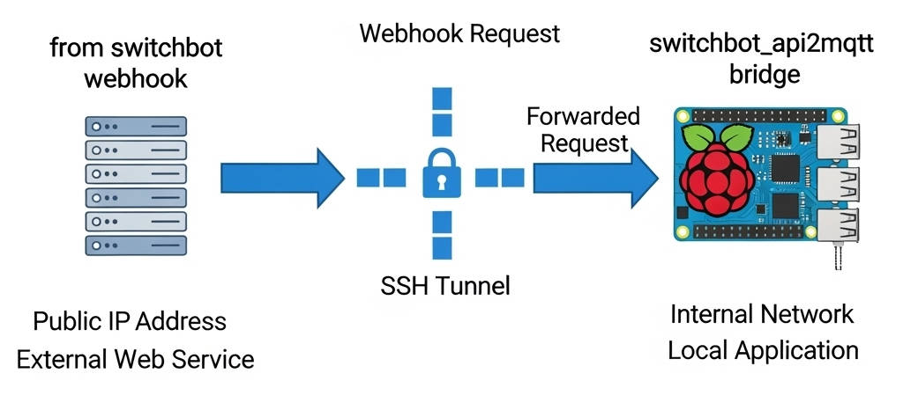

# generic-api2mqtt

`generic-api2mqtt` is a lightweight, extensible, and data-driven smart home bridge written in Python. It seamlessly connects Cloud-based Smart Home APIs (such as Samsung SmartThings and SwitchBot) with local MQTT brokers, enabling full integration and bidirectional control for home automation platforms like openHAB or Home Assistant.

The project features a fully dynamic, configuration-first architecture, allowing you to add new devices and map custom command templates completely runtime, without touching the core source code.

## Key Features

- **Data-Driven & Dynamic Command Mapping:** Define your actual smart home appliances under a `DEVICES` registry and map their capability payload templates under a `VALID_COMMANDS` dictionary inside `config.json`. The engine dynamically intercepts, parses, and formats payloads at runtime.
- **Centralized Synchronous Error Reporting:** Built around a robust inheritance model (`BaseProvider`). Any validation failures, JSON parsing anomalies, or API HTTP errors (like `422 Unprocessable Entity` or timeouts) are caught in a single centralized `try-catch` pipeline and pushed back as JSON error messages to the dedicated MQTT response topic.
- **Bidirectional Webhook Handling & Multi-Threading:** Includes an embedded multi-threaded Flask server acting as an HTTP Webhook router to intercept real-time asynchronous state updates (lifecycle events, device change reports) from external Cloud servers and instantly push them down to local MQTT state topics.
- **Periodic State Polling:** Supports background worker threads to periodically pull statuses for devices requiring active synchronization.

## Architecture Overview

The system is designed with strict Object-Oriented Programming (OOP) principles using Python's Abstract Base Classes (`ABC`):

- **`main.py`**: The core application orchestrator. It handles logging setup, reads global configurations, connects to the MQTT broker, spins up the Flask Webhook router, and spins up dedicated worker threads for providers that require active polling.
- **`providers/base_provider.py`**: The abstract engine layer containing the shared MQTT ingestion router, parsing rules, template rendering hooks (`%value%` replacement), and the centralized error handling logic.
- **`providers/smartthings.py`**: Concrete implementation tailored for the Samsung SmartThings API v1, including confirmation handshakes and real-time event extraction.
- **`providers/switchbot.py`**: Concrete implementation tailored for the SwitchBot API, managing dynamic security request signing using HMAC-SHA256, `t` (timestamps), and cryptographic nonces.

## Sample Configuration (`config.json`)

You can fully map a new device class just through configuration:

```json
{
  "SMARTTHINGS": {
    "API_BASEURL": "[https://api.smartthings.com/v1/](https://api.smartthings.com/v1/)",
    "TOKEN": "YOUR_BEARER_TOKEN",
    "DEVICES": {
      "airconditioner.study": "device-uuid-xxxx",
      "tv.livingroom": "device-uuid-yyyy"
    },
    "VALID_COMMANDS": {
      "airconditioner": {
        "on": {"component": "main", "capability": "switch", "command": "on"},
        "off": {"component": "main", "capability": "switch", "command": "off"},
        "setTemperature": {"component": "main", "capability": "thermostatCoolingSetpoint", "command": "setCoolingSetpoint", "arguments": ["%value%"]}
      },
      "tv": {
        "on": {"component": "main", "capability": "switch", "command": "on"},
        "off": {"component": "main", "capability": "switch", "command": "off"}
      }
    },
    "POLLING_INTERVAL_SEC": 300
  }
}
```

## MQTT Protocol Structure

### MQTT Request Payload Structure
Every command sent to the bridge via MQTT must be published to the inbound command topic:

*smarthome/{provider}/{device_name}/cmnd*

The request payload must strictly follow a predictable JSON structure composed of two keys:

```json
{
  "command": "command_to_execute",
  "value": "optional_value"
}
```
#### Fields Specification
 - ***command (String, Required)***: Represents the action or state query to perform. It accepts two types of values:
    - *status*: A reserved special keyword. When passed, the bridge completely bypasses the dynamic mapping templates and triggers a fallback direct API GET request to pull the full real-time status array of the device.
    - *A configured command*: Must match one of the predefined verb keys mapped under the specific device family inside config.json (e.g., airconditioner.on, airconditioner.setTemperature).
 - ***value (Any, Optional)***: Represents the dynamic argument required by the command template (such as numbers for temperature setpoints or strings for specific operational modes).
    - This field is completely optional and can be omitted if the target command template inside config.json does not contain the "%value%" placeholder string (such as simple "on" or "off" switch actions).

#### Request Examples
1. Querying Device State (Reserved Status Call):
```json
{
  "command": "status"
}
```
2. Standard Command without arguments:
```json
{
  "command": "on"
}
```
3. Dynamic Command with argument payload mapping:
```json
{
  "command": "setTemperature",
  "value": 24
}
```
### Response Topic
The bridge instantly publishes processing results or full execution errors on:

*smarthome/{provider}/{device_name}/response*

Success Object:
```json
{
  "timestamp": "2026-06-04 15:55:57.683",
  "status": "SUCCESS",
  "result": { "results": [{ "id": "xxxx", "status": "COMPLETED" }] },
  "error": null
}
```

Centralized Error Object:

```json
{
  "timestamp": "2026-06-04 15:55:58.004",
  "status": "ERROR",
  "result": null,
  "error": "API error [422]: {'code': 'ConstraintViolationError', 'message': 'The request is malformed.'}"
}
```

### Asynchronous Event Topic (Webhooks)
When an external cloud system pushes real-time asynchronous updates (such as state reports, sensor updates, or interaction events) to the bridge's HTTP Webhook endpoint, the webhook manager processes the lifecycle event and automatically forwards the raw data to the dedicated event topic:

*smarthome/{provider}/{device_name}/event*

This allows downstream automation platforms (like openHAB or Home Assistant) to listen to instantaneous changes pushed directly by cloud services, maintaining localized synchronicity without aggressive polling intervals.

#### WEBHOOK configuration

A simple video about webhook: https://youtu.be/FxlmHL5eWR8

To enable webhook integration you must configure webhook on the external system. So that webhook can work you need to have a public url to receive events.

This can be directly managed by this bridge or by a frontend http server which through Reverse Proxy forwards requests to this bridge.

It is important to know and manage security aspects before exposing services on the internet.

As an example, this is a valid setup for switchbot webhook:



- *Reception of the Webhook (Cloud Server)*: Switchbot webhook calls are sent to the public url of your cloud server (for example, http://www.example.com/switchbot_webhook). Being the server publicly accessible, it is able to receive these requests from Switchbot.
- *SSH tunnel*: the cloud server is connected to your local Raspberry Pi via an SSH tunnel. This tunnel creates a safe and persistent connection between the external server and your home network, allowing the cloud server to forward the traffic to the Raspberry Pi.
- *Forwarding of the request (Raspberry PI)*: once the webhook arrives at the Cloud server, this forwards it through the SSH tunnel to the Raspberry Pi. The Raspberry Pi, which acts as "bridge" for the webhooks, receives the request and can therefore process it.
- *Local processing*: the bridge running on the Raspberry PI performs the desired actions based on the content of the Webhook request, such as checking the status of switchbot devices or activating specific automations within your home network.

This setup allows you to receive the Switchbot Webhooks while keeping your Raspberry Pi and your home network protected behind a firewall, exposing only an intermediate server.

## Extending the Bridge (Adding New Providers)
Due to its highly decoupled and modular architecture, extending the bridge to support a brand-new cloud service or external API integration requires minimal setup.

To add a new integration, you only need to follow two simple steps:

### Create the Provider Class File
Create a new Python file inside the *providers/* directory (e.g., *providers/my_new_service.py*). This class must inherit from **BaseProvider** and implement its abstract methods:
```python
from providers.base_provider import BaseProvider

class MyNewServiceProvider(BaseProvider):
    # Implement abstract methods
    def process_status_call(self, device_id): pass
    def process_command_call(self, device_id, payload): pass
    def handle_webhook(self, path, data): pass
```

### Configure the Orchestrator Core (*main.py*)
Open *main.py* to import your new provider module and register its instance within the active providers dictionary inside the execution context block:

*Add the import statement:*
```python
from providers.my_new_service import MyNewServiceProvider
```
*Register the provider instance under the initialization section:*
```python
providers["switchbot"] = SwitchBotProvider(CONFIG["SWITCHBOT"], mqtt_client)
providers["smartthings"] = SmartThingsProvider(CONFIG["SMARTTHINGS"], mqtt_client)
providers["mynewservice"] = MyNewServiceProvider(CONFIG["MYNEWSERVICE"], mqtt_client)
```
### Add the Configuration Block
Open *config.json* and append a new root configuration block using the uppercase name of your new service as the key match (matching the string wrapper used in *main.py* like CONFIG["MYNEWSERVICE"]). Define your API endpoints, authentication tokens, topics, specific devices registry, and the command verbs mapping array.

The orchestrator engine will automatically discover the configuration mapping, initialize your new instance at startup, and start routing inbound MQTT command topics and background execution threads right away.

## Usage

- Copy *config.json.template* in *config.json* and populate config variables according to your setup
- Make the appropriate changes to the logging.json file for management of application log
- Run main.py using your python environment OR run with docker compose

## *Version 1.0 beta*
- First release with **smartthings** and **switchbot** providers implementation

## Resources
- Youtube videos
   - https://youtube.com/playlist?list=PLvTDReD06z45DfVUWST1MHsKOxrC362tf&si=CvArBUdyzhr5t1qJ
   - https://youtube.com/playlist?list=PLvTDReD06z453BYEndXaekQWU9VUCa98z&si=7UIYgk7gJYYOdzZO

## SWITCHBOT API Documentation
https://github.com/OpenWonderLabs/SwitchBotAPI?tab=readme-ov-file

## SMARTTHINGS API Documentation
https://developer.smartthings.com/docs/api/public

# DISCLAIMER

THE SOFTWARE IS PROVIDED "AS IS", WITHOUT WARRANTY OF ANY KIND, EXPRESS OR
IMPLIED, INCLUDING BUT NOT LIMITED TO THE WARRANTIES OF MERCHANTABILITY,
FITNESS FOR A PARTICULAR PURPOSE AND NONINFRINGEMENT. IN NO EVENT SHALL THE
AUTHORS OR COPYRIGHT HOLDERS BE LIABLE FOR ANY CLAIM, DAMAGES OR OTHER
LIABILITY, WHETHER IN AN ACTION OF CONTRACT, TORT OR OTHERWISE, ARISING FROM,
OUT OF OR IN CONNECTION WITH THE SOFTWARE OR THE USE OR OTHER DEALINGS IN THE
SOFTWARE.